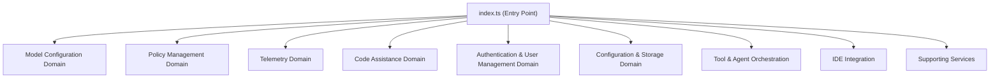
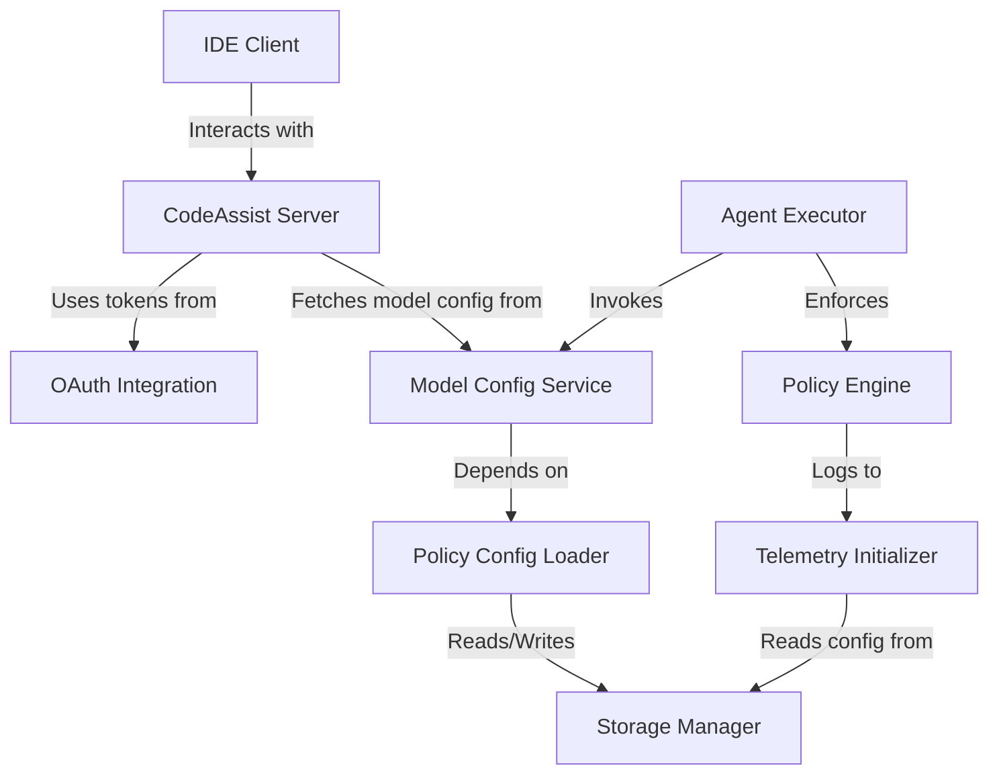
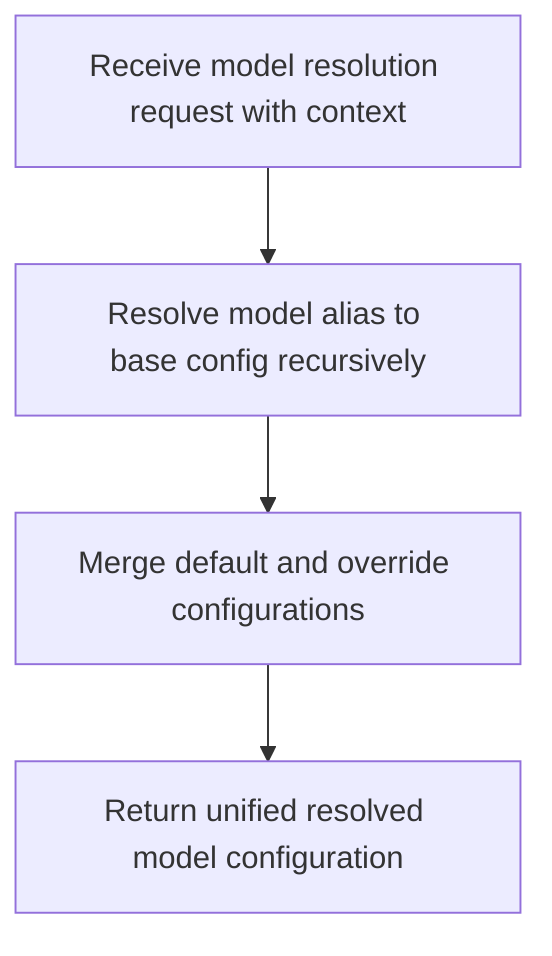
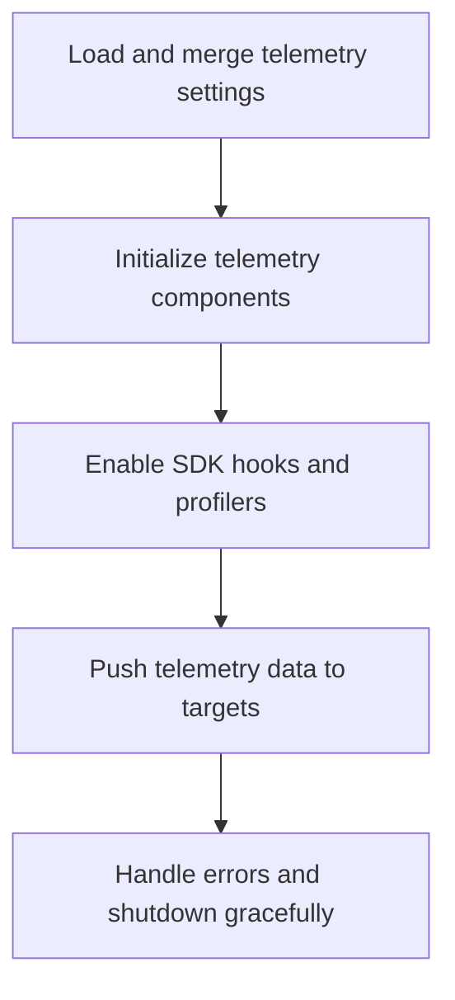
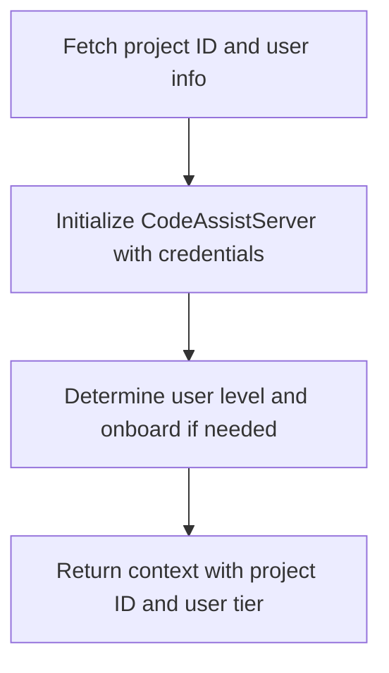
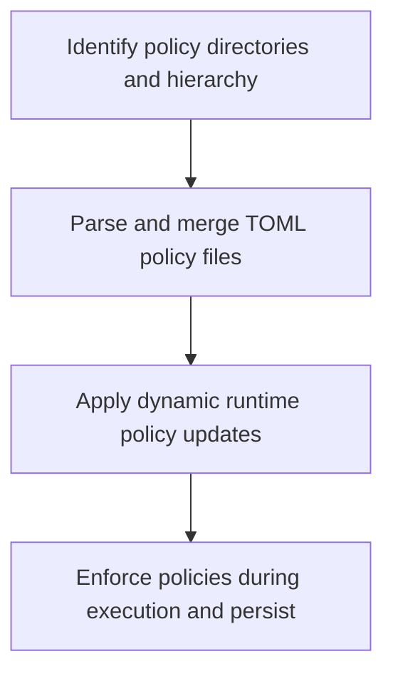
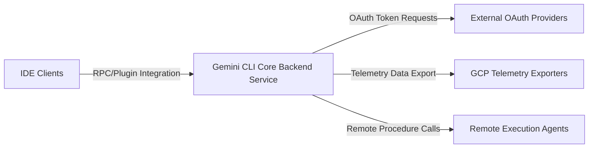

# System Architecture Document

## 1. Architecture Overview

### 1.1 Architectural Design Philosophy

The Gemini CLI Core (`src` project) is architected as a modular, layered backend service platform focused on enabling AI-driven development tooling. The design emphasizes **separation of concerns**, **high cohesion**, and **low coupling** among components to ensure maintainability, scalability, and extensibility. Each domain encapsulates a distinct business or infrastructure responsibility, facilitating independent evolution and testing.

Key architectural principles include:

- **Domain-Driven Design (DDD)**: Clear domain boundaries separate core business logic (model configuration, policy enforcement, code assistance) from infrastructure concerns (telemetry, authentication, storage).
- **Modularity and Layering**: Logical layering isolates configuration, service orchestration, and external integrations.
- **Extensibility**: Flexible configuration and policy mechanisms allow runtime overrides and dynamic updates.
- **Observability and Security**: Built-in telemetry and policy enforcement ensure operational insight and secure execution.
- **Unified Entry Point**: A single `index.ts` aggregates domain modules, providing a consistent API surface.

### 1.2 Core Architectural Patterns

- **Service-Oriented Architecture (SOA)**: The system is composed of loosely coupled services/domains communicating via well-defined interfaces.
- **Configuration Hierarchy and Inheritance**: Model configurations and policies support layered overrides and aliasing, enabling flexible customization.
- **Event-Driven Updates**: Dynamic policy updates leverage message bus events for live enforcement without downtime.
- **Client-Server Model**: Code assistance features operate via a server initialized per user/project context, integrating with IDE clients.
- **Plugin/Adapter Pattern**: IDE integration and remote execution agents are supported through adapter components, enabling extensibility.

### 1.3 Technology Stack Overview

- **Language**: TypeScript — chosen for type safety, rich ecosystem, and maintainability.
- **Runtime**: Node.js — provides asynchronous event-driven architecture, native module interoperability, and process management.
- **Configuration Formats**: TOML for policy files, JSON/TS for model configs.
- **External Integrations**:
  - OAuth providers for authentication.
  - Google Cloud Platform (GCP) for telemetry exporting.
  - IDEs via plugin/extension RPC.
  - Remote execution agents via RPC and command invocation.
- **Telemetry Tools**: Custom SDK hooks, metrics collectors, exporters, and profilers.

---

## 2. System Context

### 2.1 System Positioning and Business Value

The Gemini CLI Core backend delivers critical services enabling:

- Efficient AI model configuration management with inheritance and aliasing.
- Automated AI-powered code assistance integrated into developer IDEs.
- Robust security and policy enforcement governing model/tool usage.
- Comprehensive telemetry data collection for observability and diagnostics.
- Seamless integration with OAuth authentication providers and cloud telemetry exporters.
- Orchestration of remote execution agents and tooling frameworks.

This system enhances developer productivity by providing intelligent tooling, reduces operational risks through policy governance, and enables data-driven monitoring for system health.

### 2.2 User Roles and Scenarios

| User Role               | Description                                                                                  | Key Needs                                                                                          |
|------------------------|----------------------------------------------------------------------------------------------|--------------------------------------------------------------------------------------------------|
| **Software Developers** | Use IDEs with integrated AI code assistance and require up-to-date model configurations.     | Seamless AI code assistance, reliable remote execution, telemetry feedback.                       |
| **DevOps / SysAdmins**  | Manage deployment, security policies, telemetry infrastructure, and authentication tokens.   | Robust policy enforcement, multi-version model management, clear telemetry, secure credentialing.|
| **AI Researchers / ML Engineers** | Experiment with AI models, tune configurations, and analyze performance metrics.          | Support for model inheritance, dynamic aliasing, telemetry for usage/performance, tooling logs.  |

### 2.3 External System Interactions

- **OAuth Authentication Providers**: For user authentication and token management.
- **Google Cloud Platform Telemetry Exporters**: For exporting telemetry data and monitoring.
- **Integrated Development Environments (IDEs)**: Via plugin/extension RPC for code assistance.
- **Remote Execution Agents**: For invoking commands and AI models remotely.

### 2.4 System Boundary Definition

**Included Components:**

- Model Configuration Services
- Command and Tool Execution Agents
- Telemetry Collection and Export
- Policy Management and Enforcement
- Code Assistance and IDE Integration
- OAuth Authentication and Token Management
- Remote Invocation and Agent Framework

**Excluded Components:**

- User Interface Layers (Frontend Apps)
- External Cloud Infrastructure beyond telemetry and OAuth
- Third-Party IDEs themselves (only integration adapters included)

---

## 3. Container View

### 3.1 Domain Module Partitioning

The system is partitioned into the following primary domains (containers):

### 3.2 Domain Module Architecture

| Domain                         | Responsibilities                                                                                  | Key Modules / Files                                      |
|-------------------------------|-------------------------------------------------------------------------------------------------|----------------------------------------------------------|
| **Model Configuration Domain** | Manage AI model configs, aliasing, inheritance, scenario overrides                               | `services/modelConfigService.ts`, `config/models.ts`     |
| **Policy Management Domain**   | Load, merge, enforce security policies; dynamic runtime updates                                 | `policy/config.ts`, `policy/policy-engine.ts`            |
| **Telemetry Domain**           | Collect, export metrics/logs; initialize profilers and SDK hooks                               | `telemetry/index.ts`, `telemetry/config.ts`              |
| **Code Assistance Domain**     | Setup user/project environment; initialize code assist server                                  | `code_assist/setup.ts`, `code_assist/server.ts`          |
| **Authentication Domain**      | OAuth integration, token management, credential storage                                        | `mcp/oauth-provider.ts`, `code_assist/oauth2.ts`         |
| **Configuration & Storage**   | Manage config files, project-specific storage paths                                            | `config/storage.ts`, `config/config.ts`                   |
| **Tool & Agent Orchestration**| Manage execution agents, tool registries, remote invocation                                   | `agents/*.ts`, `tools/*.ts`                               |
| **IDE Integration**            | Detect IDE environment, manage IDE client connections                                         | `ide/ide-client.ts`, `ide/detect-ide.ts`                  |
| **Supporting Services**        | File discovery, git integration, shell execution, session management                           | `services/*.ts`                                           |

### 3.3 Storage Design

- Configuration files and policy TOML files are stored in hierarchical directories supporting default, user, and admin layers.
- Project-specific data and temporary files are isolated per project to avoid conflicts.
- Telemetry data is buffered locally and exported to external endpoints (e.g., GCP).
- OAuth tokens and credentials are securely stored and refreshed as needed.

### 3.4 Inter-Domain Communication

- **Model Configuration Domain** depends on **Policy Management Domain** for policy compliance during model selection.
- **Code Assistance Domain** depends on **Authentication Domain** for user/project identity and tokens.
- **Policy Management Domain** depends on **Configuration & Storage Domain** for persistent policy files.
- **Telemetry Domain** depends on **Configuration & Storage Domain** for exporter configs and buffering.
- **Policy Management Domain** logs enforcement events to **Telemetry Domain**.
- **Tool & Agent Orchestration** interacts with **Model Configuration** and **Policy Management** for secure command execution.
- **IDE Integration** interacts primarily with **Code Assistance Domain** to provide AI features.

---

## 4. Component View

### 4.1 Core Functional Components

| Component                      | Domain                      | Responsibilities                                                                                   |
|-------------------------------|-----------------------------|--------------------------------------------------------------------------------------------------|
| **Model Config Service**       | Model Configuration         | Resolve model configs with aliasing, inheritance, and overrides; expose unified config objects.   |
| **Policy Config Loader**       | Policy Management           | Load and merge TOML policy files; parse and validate rules.                                      |
| **Policy Engine**              | Policy Management           | Enforce policies during execution; apply dynamic updates from message bus events.                 |
| **Telemetry Initializer**      | Telemetry                   | Initialize telemetry collectors, exporters, SDK hooks, and profilers.                            |
| **CodeAssist Server**          | Code Assistance             | Manage code assistance sessions; handle user/project context and onboarding.                      |
| **OAuth Integration**          | Authentication & User Mgmt  | Acquire, refresh, and store OAuth tokens securely.                                               |
| **Storage Manager**            | Configuration & Storage     | Manage file system paths for configs, credentials, and project data.                             |
| **Agent Executor**             | Tool & Agent Orchestration  | Execute commands and AI models locally or remotely; manage tool registry.                        |
| **IDE Client**                 | IDE Integration             | Detect IDE environment; maintain client connection and context for code assistance.              |

### 4.2 Technical Support Components

- **File Discovery Service**: Supports agents with file system scanning.
- **Git Service**: Provides version control integration for tooling.
- **Shell Execution Service**: Executes shell commands securely.
- **Credential Storage**: Securely stores OAuth tokens and credentials.

### 4.3 Component Responsibilities and Interactions

---

## 5. Key Processes

### 5.1 Core Functional Workflow: Model Configuration Resolution

- **Description**: Dynamically resolves the most appropriate AI model configuration based on input context such as model alias, scenario, retry attempts, and user overrides.
- **Steps**:
  1. Receive request specifying model context.
  2. Recursively resolve aliases and inheritance to base configuration.
  3. Merge default, scenario-specific, and user-defined overrides.
  4. Return unified configuration for downstream AI model invocation or code assistance.

### 5.2 Telemetry Initialization and Operation

- **Description**: Sets up telemetry data collection, exporting, and profiling to ensure system observability.
- **Steps**:
  1. Load telemetry configuration from CLI, environment, and config files.
  2. Initialize collectors, exporters, and logging facilities.
  3. Enable SDK hooks and activity profilers.
  4. Continuously push telemetry data to configured targets.
  5. Handle errors and perform graceful shutdown.

### 5.3 User Environment and Code Assist Setup

- **Description**: Prepares the user and project context for AI-powered code assistance.
- **Steps**:
  1. Detect project and user identifiers from environment or authentication context.
  2. Initialize the code assistance server with credentials.
  3. Determine user tier and perform onboarding via long-polling if necessary.
  4. Return ready-to-use context for subsequent code assistance operations.

### 5.4 Policy Enforcement and Dynamic Rule Update

- **Description**: Manages hierarchical policy loading, dynamic updates, and enforcement during model/tool execution.
- **Steps**:
  1. Identify policy files from default, user, and admin directories.
  2. Parse and merge TOML policy files, handling errors gracefully.
  3. Listen for runtime events or message bus notifications to update policies dynamically.
  4. Enforce policies during execution and persist changes as needed.

### 5.5 Error Handling and Resilience

- Telemetry and policy modules include robust error handling to ensure graceful degradation.
- Dynamic updates are applied atomically to avoid inconsistent states.
- Authentication token refresh mechanisms handle expiry and renewal transparently.
- Execution agents implement retries and fallback strategies for remote invocation failures.

---

## 6. Technical Implementation

### 6.1 Core Module Implementations

- **Model Configuration Service (`services/modelConfigService.ts`)**:
  - Implements recursive alias resolution and inheritance.
  - Supports layered configuration merging with precedence rules.
  - Exposes APIs such as `resolveConfig`, `registerAlias`, and `applyOverrides`.

- **Policy Management (`policy/config.ts`, `policy/policy-engine.ts`)**:
  - Loads TOML policy files with layered precedence.
  - Parses rules into in-memory structures for fast enforcement.
  - Supports dynamic updates via `onPolicyUpdateEvent`.
  - Enforces policies during model/tool invocation.

- **Telemetry (`telemetry/index.ts`, `telemetry/config.ts`)**:
  - Parses telemetry settings from multiple sources.
  - Initializes exporters (including GCP), SDK hooks, and profilers.
  - Implements `initTelemetry`, `shutdownTelemetry`, and `recordMetrics`.

- **Code Assistance (`code_assist/setup.ts`, `code_assist/server.ts`)**:
  - Sets up user environment and authentication context.
  - Manages onboarding and user tier determination.
  - Provides server APIs for IDE integration.

- **Authentication (`mcp/oauth-provider.ts`, `code_assist/oauth2.ts`)**:
  - Implements OAuth token acquisition and refresh.
  - Securely stores credentials.
  - Provides authentication context to dependent domains.

### 6.2 Key Algorithmic Designs

- **Recursive Model Alias Resolution**: Uses depth-first traversal with cycle detection to resolve model aliases to base configurations.
- **Configuration Merging**: Applies layered overrides using deep merge strategies, respecting scenario and user-defined precedence.
- **Policy Rule Parsing**: TOML files parsed into structured rule sets with validation and conflict resolution.
- **Dynamic Policy Updates**: Event-driven updates applied atomically to in-memory policy state.
- **Telemetry Data Aggregation**: Buffered metrics and logs are batched and exported asynchronously to minimize performance impact.

### 6.3 Data Structures

- **Model Configuration Objects**: Hierarchical JSON-like structures with fields for parameters, aliases, and overrides.
- **Policy Rule Sets**: In-memory maps keyed by policy scope, with rule conditions and actions.
- **Telemetry Buffers**: Circular buffers for metrics and logs with timestamped entries.
- **Authentication Tokens**: Secure token objects with expiry and refresh metadata.

### 6.4 Performance Optimization Strategies

- Caching resolved model configurations to avoid repeated recursive resolution.
- Asynchronous telemetry exporting to prevent blocking main execution flows.
- Lazy loading of policy files and incremental updates to minimize startup latency.
- Efficient event handling for dynamic policy updates.
- Connection pooling and token caching for OAuth interactions.

---

## 7. Deployment Architecture

### 7.1 Runtime Environment Requirements

- **Node.js Runtime**: Version compatible with TypeScript transpilation and async features.
- **Operating System**: Linux or macOS preferred for production; Windows supported for development.
- **Network Access**: Required for OAuth providers, telemetry exporters (e.g., GCP), IDE plugin communication, and remote agents.
- **Storage**: Persistent file system access for configuration, policy files, and credential storage.

### 7.2 Deployment Topology

- The backend service runs as a standalone Node.js process.
- Integrates with external OAuth providers for authentication.
- Exports telemetry data to GCP or other configured endpoints.
- Communicates with IDE clients via RPC or plugin protocols.
- Invokes remote execution agents for command and AI model execution.

### 7.3 Scalability and Extensibility

- Modular domain design allows horizontal scaling of individual services if decoupled.
- Configuration-driven model and policy management enable runtime extensibility without redeployment.
- Plugin-based IDE integration supports adding new IDEs or tooling with minimal changes.
- Agent framework supports adding new execution environments or remote nodes.

### 7.4 Monitoring and Operations

- Telemetry domain provides continuous metrics and logs for system health.
- Policy enforcement events are logged for audit and compliance.
- Graceful shutdown and error handling ensure operational stability.
- Configuration and storage domains support hot reloads and dynamic updates.
- Authentication token lifecycle management reduces downtime due to expired credentials.

---

# Summary

The Gemini CLI Core backend system is a robust, modular platform designed to support AI-driven development workflows through dynamic model configuration, secure policy enforcement, comprehensive telemetry, and seamless IDE integration. Its layered architecture, combined with event-driven updates and extensible configuration, ensures maintainability, scalability, and operational observability. The system’s design balances technical rigor with practical developer and operational needs, providing a solid foundation for evolving AI-powered tooling ecosystems.

---

If further detailed component diagrams, sequence diagrams, or code-level documentation are required, please advise accordingly.