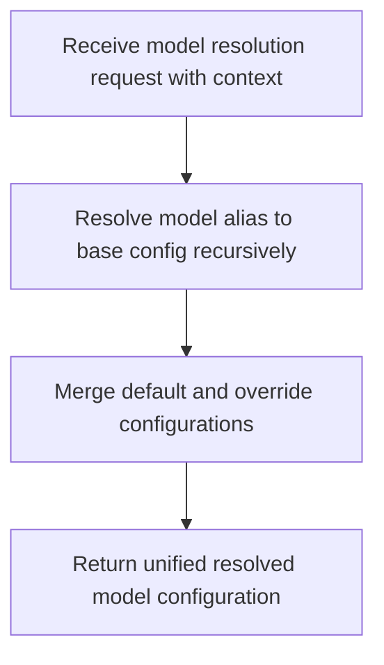
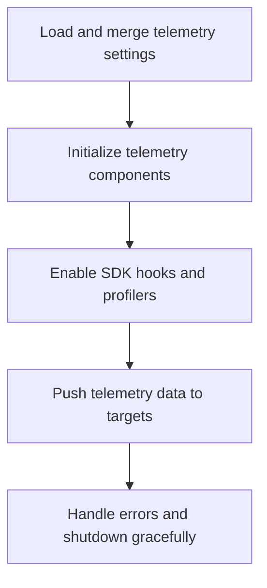
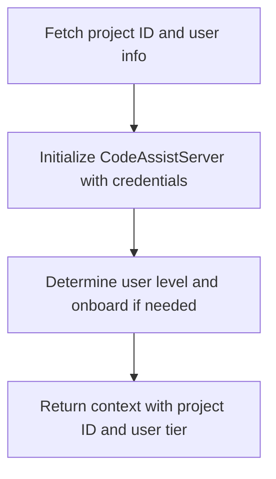
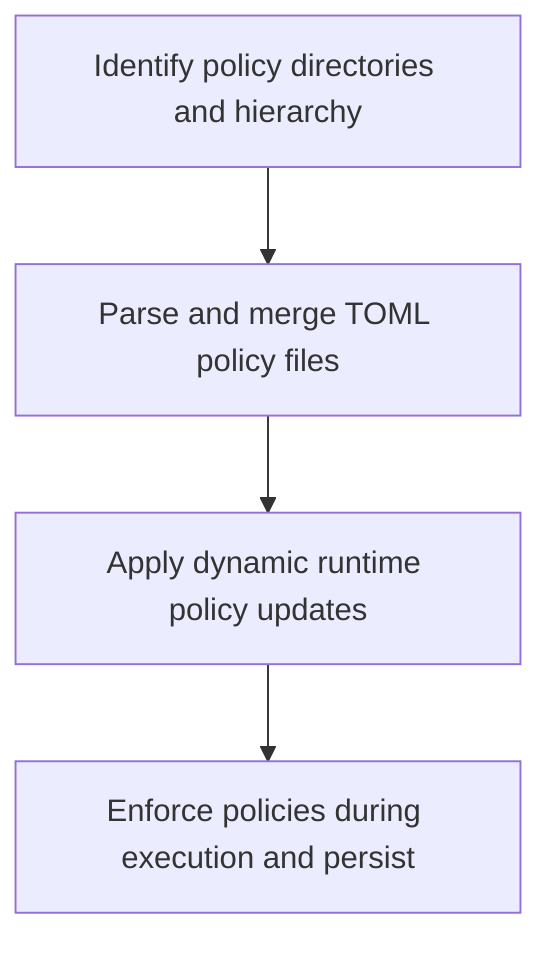

# Core Workflow Documentation

Generated at: 2025-12-24 00:42:05 (UTC) (UTC)  
Timestamp: 1766536925

---

# Core Workflow

## 1. Workflow Overview

### System Main Workflow and Core Execution Path

The system’s core workflow centers on dynamically resolving the most appropriate AI model configuration tailored to specific use cases. This resolution process is foundational, as it directly influences downstream AI model invocation, code assistance features, and tool execution. The workflow ensures that model parameters are selected accurately by processing contextual inputs such as model aliases, scenario contexts, retry attempts, and user-defined override rules.

The core execution path involves:

- Receiving a model resolution request with contextual parameters.
- Recursively resolving model aliases and inheritance hierarchies.
- Applying layered configuration overrides (default, scenario-specific, user-defined).
- Returning a unified, resolved model configuration for downstream consumption.

This workflow is tightly integrated with other subsystems such as policy enforcement (which governs model usage constraints), telemetry (which monitors operational metrics), authentication (which provides user/project context), and code assistance (which consumes resolved configurations).

### Key Workflow Nodes

- **Request Intake:** Entry point where model resolution requests are received with context.
- **Alias Resolution:** Recursive mapping of model aliases to base configurations.
- **Configuration Merging:** Layered merging of default and override configurations.
- **Final Resolution:** Output of a unified model configuration object.
- **Downstream Usage:** Model invocation, code assistance, and telemetry reporting.

### Flow Coordination Mechanism

The system employs a modular architecture with clear domain boundaries. Coordination is achieved through:

- Well-defined service interfaces (e.g., `ModelConfigService`).
- Event-driven updates for dynamic policy and telemetry changes.
- Shared configuration and storage layers for consistent state management.
- Authentication context propagation to dependent modules.

---

## 2. Main Workflows

### 2.1 Model Configuration Resolution Workflow

**Description:**  
This workflow resolves the AI model configuration for a given request context, supporting aliasing, inheritance, and overrides to produce a consistent configuration for AI model invocation.

**Execution Steps:**

**Detailed Explanation:**

- **Step A:** The system receives a request specifying the desired model context, including alias names, scenario identifiers, retry flags, or user-specific overrides.
- **Step B:** The `ModelConfigService` recursively resolves aliases to base configurations, ensuring no cyclic dependencies and applying inheritance rules.
- **Step C:** The service merges the base configuration with scenario-specific and user-defined overrides, respecting priority and scope rules.
- **Step D:** The final resolved configuration is returned for use by downstream components such as AI model invocation engines or code assistance modules.

**Input/Output:**

- **Input:** Model alias, scenario context, retry flag, user override parameters.
- **Output:** Fully resolved model configuration object containing model name, generation parameters (temperature, topP, topK, etc.), and tool-specific settings.

---

### 2.2 Telemetry Initialization and Operation Workflow

**Description:**  
Manages the setup and operational lifecycle of telemetry data collection, exporting, and monitoring across the system.

**Execution Steps:**

**Detailed Explanation:**

- **Step A:** Telemetry settings are loaded and merged from CLI arguments, environment variables, and configuration files using `resolveTelemetrySettings`.
- **Step B:** Telemetry components such as metric collectors, exporters (including GCP exporters), loggers, and startup profilers are initialized.
- **Step C:** SDK hooks and activity monitors are enabled to capture runtime metrics and profiling data.
- **Step D:** Collected telemetry data is pushed to configured targets (local storage, GCP endpoints).
- **Step E:** Errors during telemetry operations are handled gracefully, with support for clean shutdown and resource release.

**Input/Output:**

- **Input:** Telemetry configuration parameters.
- **Output:** Active telemetry data streams and exported metrics/logs.

---

### 2.3 User Environment and Code Assist Setup Workflow

**Description:**  
Prepares the user and project environment for code assistance features, including authentication, user tier determination, and onboarding.

**Execution Steps:**

**Detailed Explanation:**

- **Step A:** The system fetches project ID and user information from environment variables or authentication contexts.
- **Step B:** Initializes the `CodeAssistServer` with the obtained credentials.
- **Step C:** Determines the user’s operational tier; if the user is new, onboarding procedures are executed via long-polling until completion.
- **Step D:** Returns a context object containing project ID and user tier for subsequent code assistance operations.

**Input/Output:**

- **Input:** Authentication tokens, environment variables.
- **Output:** User context with project ID and tier level.

---

### 2.4 Policy Enforcement and Dynamic Rule Update Workflow

**Description:**  
Manages loading, merging, and enforcement of security and operational policies, supporting dynamic updates and integration with telemetry.

**Execution Steps:**

**Detailed Explanation:**

- **Step A:** The system identifies policy files from default, user, and admin directories, establishing a hierarchy.
- **Step B:** TOML policy files are parsed and merged, with error handling for file access or syntax issues.
- **Step C:** Listens for runtime events or message bus notifications to apply dynamic policy updates.
- **Step D:** Enforces the active policy set during model or tool execution, persisting changes as needed and reporting to telemetry for audit.

**Input/Output:**

- **Input:** Policy files, runtime update events.
- **Output:** Active policy rules enforced on system operations.

---

## 3. Flow Coordination and Control

### Multi-Module Coordination Mechanisms

- **Service Interfaces:** Each domain exposes well-defined APIs (e.g., `ModelConfigService`, `CodeAssistServer`) to decouple implementation and enable modular interaction.
- **Event Bus:** Dynamic updates (e.g., policy changes) are propagated via message bus events, ensuring timely synchronization.
- **Configuration Layer:** Shared configuration and storage modules provide consistent access to paths, credentials, and settings across domains.
- **Authentication Context:** Authentication and user identity information flow from the Authentication domain to Code Assistance and Model Configuration domains, ensuring secure and context-aware operations.

### State Management and Synchronization

- **Immutable Configuration Objects:** Resolved configurations are treated as immutable snapshots to prevent race conditions.
- **Versioning and Overrides:** Policy and model configurations support layered overrides with clear precedence, enabling consistent state resolution.
- **Long-Polling for Onboarding:** User onboarding uses long-polling to synchronize user state changes asynchronously.

### Data Passing and Sharing

- **Context Objects:** Workflows pass context objects encapsulating user, project, and configuration data.
- **Shared Storage Paths:** The Storage domain manages paths for credentials, temporary files, and policy storage, enabling cross-module data sharing.
- **Telemetry Data Streams:** Telemetry domain collects and shares operational metrics with policy and model domains for auditing.

### Execution Control and Scheduling

- **Synchronous Resolution:** Model configuration resolution is synchronous to guarantee immediate availability for downstream usage.
- **Asynchronous Updates:** Policy updates and telemetry data pushing operate asynchronously to minimize impact on core workflows.
- **Error Propagation:** Errors in dependent modules propagate up to allow coordinated handling and recovery.

---

## 4. Exception Handling and Recovery

### Error Detection and Handling

- **Configuration Validation:** Configuration modules validate inputs and throw detailed exceptions (e.g., `FatalConfigError`) on invalid parameters.
- **Alias Resolution Cycles:** The model configuration service detects cyclic alias dependencies and prevents infinite recursion.
- **File Access Errors:** Policy loader handles file read errors gracefully, logging issues without crashing the system.
- **Authentication Failures:** Missing or invalid credentials trigger specific exceptions (e.g., `ProjectIdRequiredError`) to prompt corrective action.

### Exception Recovery Mechanisms

- **Fallback Defaults:** On missing overrides or invalid configurations, the system falls back to base defaults to maintain operability.
- **Retry Logic:** Model configuration supports retry flags to adjust parameters dynamically on failure scenarios.
- **Graceful Shutdown:** Telemetry components implement shutdown hooks to flush data and release resources cleanly on errors or termination.
- **User Onboarding Retry:** Long-polling onboarding retries until success or timeout, ensuring user readiness.

### Fault Tolerance Strategies

- **Isolation of Domains:** Failures in telemetry or policy modules do not block core model resolution or code assistance workflows.
- **Error Logging and Alerts:** Telemetry captures error events for operational monitoring and alerting.
- **Dynamic Policy Updates:** Runtime policy changes can disable problematic rules without requiring system restarts.

### Failure Retry and Degradation

- **Configurable Retry Attempts:** Model configuration supports configurable retry attempts with adjusted parameters.
- **Degraded Mode:** In case of persistent failures, the system can operate with minimal default configurations, disabling advanced features temporarily.
- **Fallback Authentication:** If OAuth tokens expire, refresh mechanisms attempt renewal before failing.

---

## 5. Key Process Implementation

### Core Algorithmic Flow: Model Configuration Resolution

- **Recursive Alias Resolution:**  
  The system recursively resolves model aliases by traversing alias mappings until a base configuration is found. Cycle detection prevents infinite loops.

- **Hierarchical Configuration Merge:**  
  Base configurations are merged with scenario-specific and user overrides using deep merge strategies, respecting override precedence.

- **Dynamic Override Application:**  
  Overrides can be applied based on runtime context such as retry flags or user roles, enabling flexible configuration adaptation.

### Data Processing Pipeline

- **Input:** Model alias and context parameters.  
- **Processing:** Alias resolution → Configuration merging → Validation → Output generation.  
- **Output:** Final model configuration object.

### Business Rule Execution

- **Alias Inheritance:** Ensures that derived configurations inherit properties from base models unless explicitly overridden.  
- **Override Priority:** User-defined overrides take precedence over scenario defaults, which in turn override base configurations.  
- **Validation:** Ensures configuration completeness and correctness before usage.

### Technical Implementation Details

- **TypeScript Modules:** The `ModelConfigService` is implemented as a TypeScript class with methods like `resolveConfig`, `registerAlias`, and `applyOverrides`.  
- **Configuration Storage:** Model configurations are stored as JSON-like objects with hierarchical keys.  
- **Error Handling:** Custom error classes provide detailed diagnostics for configuration issues.  
- **Performance:** Caching mechanisms reduce repeated resolution overhead; asynchronous operations are minimized in critical paths.

---

# Summary

This document provides a comprehensive and detailed description of the core workflows within the Gemini CLI Core backend system. It covers the main business and technical workflows, coordination mechanisms, exception handling strategies, and key implementation details. The workflows are designed to ensure flexible, secure, and performant AI model configuration management, telemetry monitoring, policy enforcement, and code assistance setup, supporting a robust and scalable developer tooling platform.

---

# Appendix: Core Workflow Mermaid Diagrams

### Model Configuration Resolution

### Telemetry Initialization and Operation

### User Environment and Code Assist Setup

### Policy Enforcement and Dynamic Rule Update

---

This documentation is intended to guide development, operations, and new team members in understanding and maintaining the core workflows of the system effectively.