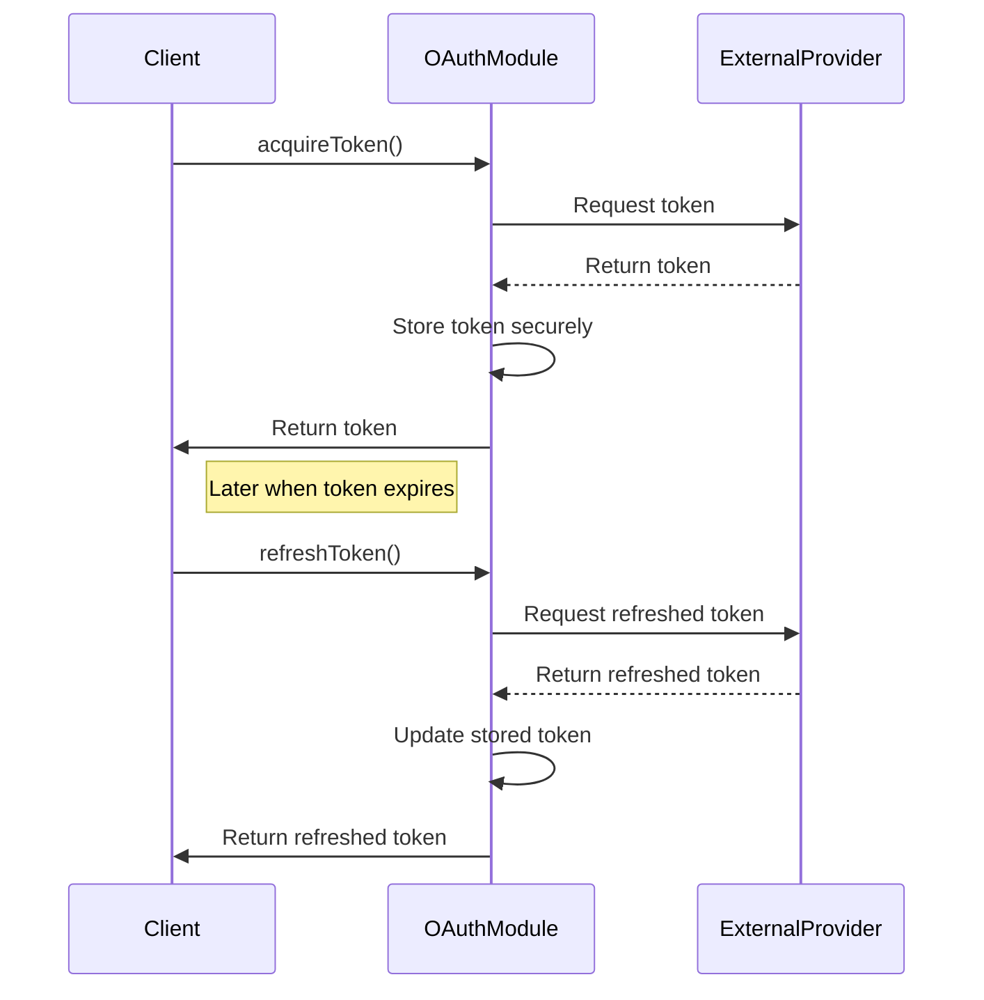

# Authentication and User Management Domain - Technical Documentation

## Overview

The Authentication and User Management Domain is a critical infrastructure component within the Gemini CLI Core backend system. It is responsible for managing secure user authentication flows, OAuth token lifecycle management, and credential storage. This domain ensures that the system maintains authorized access to external services and APIs by integrating with external OAuth providers, handling token acquisition, refresh, and secure storage transparently.

This domain underpins secure operations and access control across the system, providing authentication context and credentials to dependent modules such as the Code Assistance Domain and other backend services requiring authenticated API calls.

---

## Domain Responsibilities

- **OAuth Integration:** Implements OAuth 2.0 flows to acquire and refresh access tokens from external OAuth providers.
- **Token Storage:** Securely stores and retrieves OAuth tokens to maintain session continuity without manual user intervention.
- **User and Project Identity Management:** Provides authenticated user and project context to other system components.
- **Token Lifecycle Management:** Handles token expiration, refresh, and update processes to ensure uninterrupted authorized access.
- **Authentication Context Provision:** Supplies authentication tokens and user identity information to dependent domains such as code assistance.

---

## Key Modules and Components

### 1. OAuth Integration Module

- **Location:** `mcp/oauth-provider.ts`, `code_assist/oauth2.ts`
- **Description:** This module manages the OAuth 2.0 authentication flows, including authorization code and client credentials flows. It interacts with external OAuth providers via secure API calls to acquire access tokens, refresh tokens when expired, and handle token lifecycle events.
- **Core Interfaces:**
  - `MCPOAuthConfig`: Configuration parameters for OAuth providers including client ID, secret, authorization URLs, scopes, and redirect URIs.
  - `OAuthAuthorizationResponse`: Represents the authorization code and state returned from OAuth authorization.
  - `OAuthTokenResponse`: Represents the access token, refresh token, expiry, and scope returned from the token endpoint.
- **Key Classes and Functions:**
  - `MCPOAuthProvider`: The main class responsible for managing OAuth token acquisition, refresh, and secure storage.
  - `acquireToken()`: Initiates the OAuth flow to obtain an access token.
  - `refreshToken()`: Refreshes an expired token using the refresh token.
- **Security Features:**
  - Uses Proof Key for Code Exchange (PKCE) to enhance security during authorization code flow.
  - Securely stores tokens using encrypted storage mechanisms.
  - Handles token expiration and automatic refresh to maintain valid credentials.
- **Flow:**
  1. Start OAuth integration.
  2. Acquire token from external provider.
  3. Store token securely.
  4. Use token for authenticated requests.
  5. Refresh token if expired.
  6. Update stored token.
  7. End process.

### 2. Credential Storage Module

- **Location:** `code_assist/oauth-credential-storage.ts`
- **Description:** Manages secure storage and retrieval of OAuth tokens and credentials. Ensures tokens are encrypted at rest and accessible only to authorized components.
- **Responsibilities:**
  - Persist tokens securely on disk or in memory.
  - Provide interfaces for token retrieval and update.
  - Support token lifecycle events such as refresh and revocation.

---

## Interaction with Other Domains

- **Code Assistance Domain:** The Authentication Domain provides authentication tokens and user identity context required to initialize and operate the code assistance server (`code_assist/setup.ts`). This enables secure, authenticated AI-powered code assistance features.
- **External OAuth Providers:** The domain interacts with external OAuth providers through secure HTTP API calls to perform token acquisition and refresh operations.
- **Configuration and Storage Domain:** Utilizes configuration paths and secure storage mechanisms defined in the Configuration and Storage Domain to manage token persistence.
- **Telemetry Domain:** May emit authentication-related events for telemetry and monitoring purposes.

---

## Sequence Diagram of OAuth Token Lifecycle

---

## Technical Implementation Details

### OAuth Provider (`mcp/oauth-provider.ts`)

- Implements OAuth 2.0 flows with support for:
  - Authorization code grant with PKCE.
  - Client credentials grant.
- Manages OAuth configuration parameters such as client ID, secret, scopes, authorization and token URLs.
- Uses Node.js HTTP modules for secure communication.
- Handles redirect URI callbacks and token parsing.
- Integrates with a secure token storage backend (`MCPOAuthTokenStorage`).
- Emits events for OAuth display messages and errors.
- Includes error handling for resource mismatches and token acquisition failures.

### OAuth2 Client (`code_assist/oauth2.ts`)

- Uses Google-auth-library for OAuth client management.
- Defines OAuth client ID, secret, and scopes for Google Cloud Platform integration.
- Manages user login flows including opening browser windows for user consent.
- Handles token refresh and credential updates.
- Provides event emitters for authentication lifecycle events.
- Supports command-line interaction for user authentication.
- Integrates with credential storage for persistence.
- Implements robust error handling for authentication failures and cancellations.

---

## Summary

The Authentication and User Management Domain is a foundational backend service that enables secure, seamless OAuth-based authentication for the Gemini CLI Core system. By managing token acquisition, refresh, and secure storage, it ensures continuous authorized access to external services and APIs. This domain supports dependent modules such as code assistance by providing authenticated user and project contexts, thereby enabling secure AI-powered development tooling. Its implementation leverages modern OAuth standards, secure storage practices, and event-driven architecture to maintain robust and extensible authentication workflows.

---

*Document generated on: 2025-12-24 00:43:33 (UTC) (UTC)*